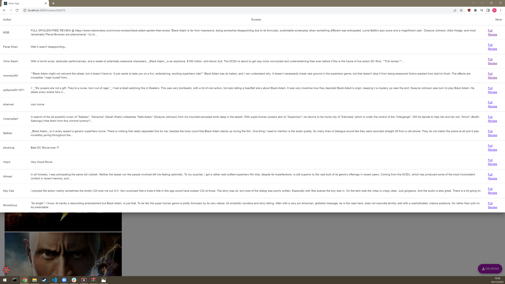

# Web App Dev 2 - Assignment 1 - ReactJS app.

Name: Dean Lonergan

## Overview.

### New Pages.

+ List of Popular Actors.
+ Actor details.
+ Favourite actors.
+ List of TV Shows.
+ TV Show details.
+ Favourite TV Shows.

### New Features.

+ View actors details (biography, gender, dob, etc.)
+ Add/remove favourite actors (with custom avatar).
+ Filter actors by name.
+ View TV show details (genre, production countries, overview, etc.)
+ Filter TV shows by name, genre.
+ Add/remove favourite TV shows.

## Setup requirements.

npm install, npm start.

## TMDB endpoints.

+ /reviews/{movie_id} - The user reviews or a movie.
+ /movies/upcoming - List of upcoming movies,
+ /movies/favourites - List of favourited movies.
+ /movies/mustwatch - List of 'must watch' upcoming movies.
+ /movies/{movie_id} - A movies' details page.
+ /actors - List of popular actors.
+ /actors/{actor_id} - An actors details page.
+ /actors/favourites - List of favourited actors.
+ /tvshows - List of TV shows.
+ /tvshows/{tvshow_id} - A TV Shows' details page.
+ /tvshows/favourites - List of favourited TV shows.

## App Design.

### Component catalogue.

### UI Design.

>Shows detailed information on a movie. Clicking the 'Reviews' floating action button will display extracts from critic reviews.

>Shows the full review for a movie.

>Shows a list of popular TV shows.

>Shows the details of a selected TV show.

>Shows a list of a users favourited TV shows.

>Shows a list of popular actors.

>Shows the biography of a selected actor.

>Shows a list of a users favourited actors.

### Routing.

+ /reviews/:id - Displays the reviews of a particular movie.
+ /movies/upcoming - Displays a list of upcoming movies.
+ /movies/favourites - Displays a list of favourited movies.
+ /movies/mustwatch - Displays a list of upcoming movies selected as 'must watch'.
+ /movies/:id - Displays a movies' details page based on it's ID.
+ /actors - Displays a list of popular actors.
+ /actors/:id - Displays an actors details page based on their ID.
+ /actors/favourites - Displays a List of favourited actors.
+ /tvshows - Displays a list of popular TV shows.
+ /tvshows/:id - Displays a TV Shows' details page based on it's ID.
+ /tvshows/favourites - Displays a list of favourited TV shows.

## Independent learning (If relevant).

I referred to the api extensively.
https://developers.themoviedb.org/3/people/get-person-details
https://developers.themoviedb.org/3/tv
